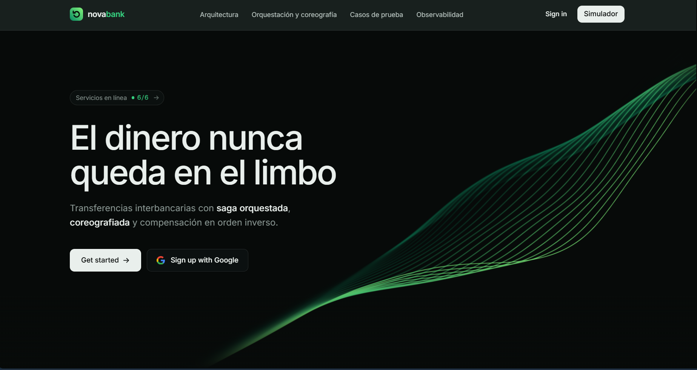
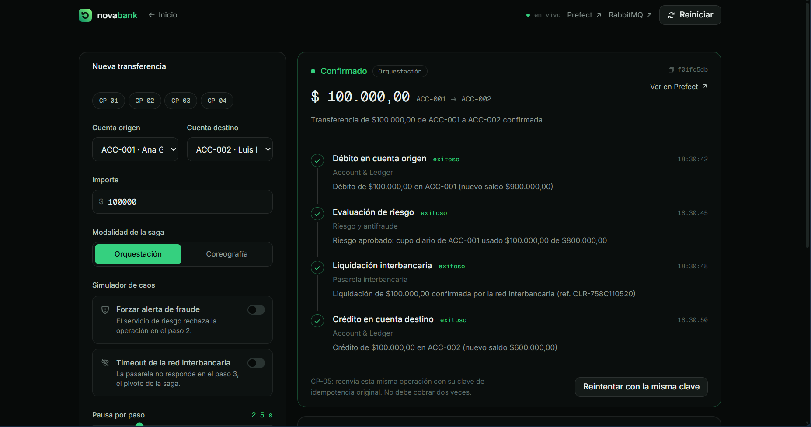
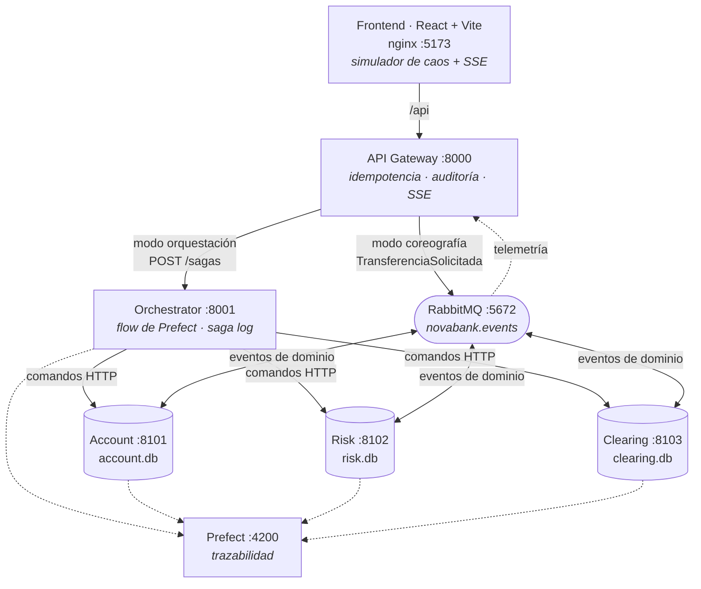
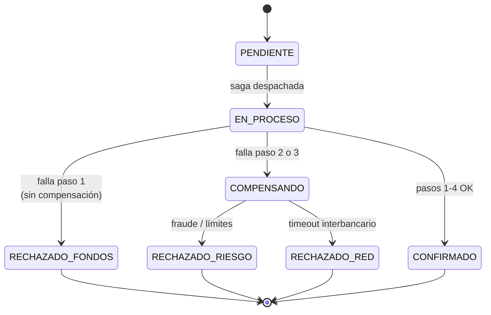
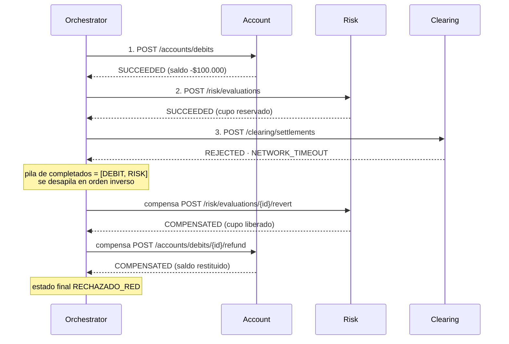
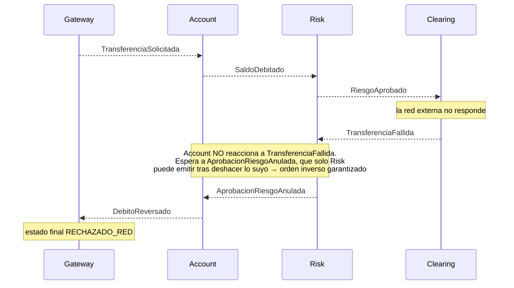
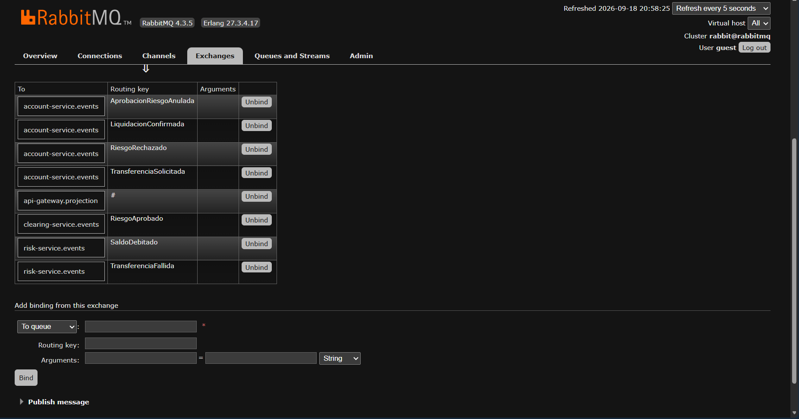
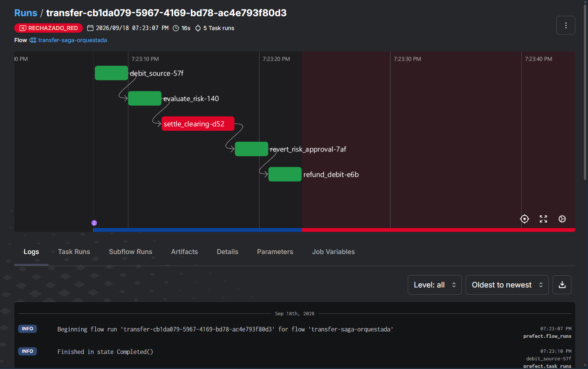
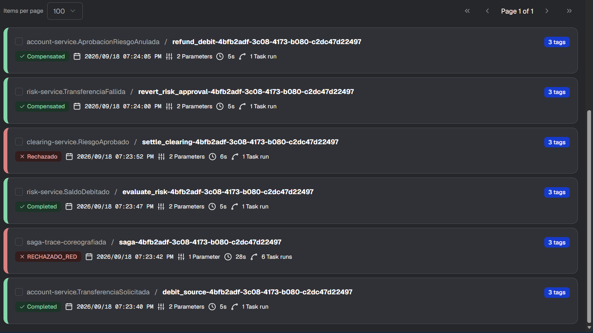
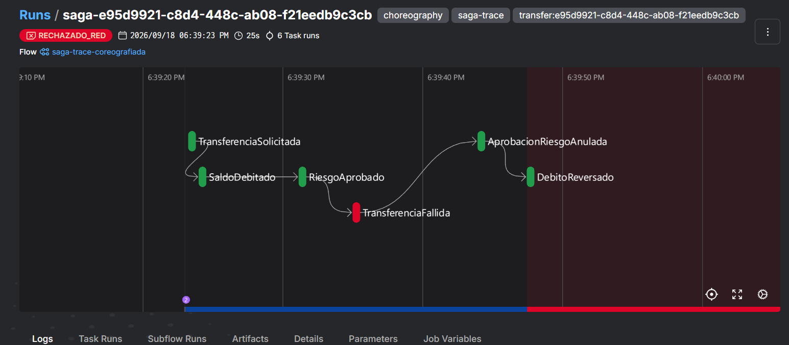

# NovaBank International - Patrón Saga bancario

[](#)
[](#)
[](#)
[](#)
[](#)
[](#)
[](#)
[](#)
[](#)
[](#)

**Juan David Cruz** · **Ángel Julián David Aguilar Zambrano**



Transferencias interbancarias distribuidas bajo el modelo **BASE**, implementadas con el patrón Saga en
**las dos modalidades**: orquestación (coordinador central con Prefect) y coreografía (eventos sobre
RabbitMQ, sin coordinador). Incluye simulador de caos, compensaciones estrictas en orden inverso,
idempotencia de punta a punta y observabilidad en tiempo real.

Taller completo en [`TALLER.md`](TALLER.md) · Diseño en [`docs/PLAN.md`](docs/PLAN.md) · Comparativa en
[`docs/orquestacion-vs-coreografia.md`](docs/orquestacion-vs-coreografia.md).

## Video demostrativo

[](https://www.youtube.com/watch?v=9cw97uO2bDE)

Haz clic en la imagen para reproducirlo. Recorrido completo del proyecto: la arquitectura, los cinco casos
de prueba en las dos modalidades y la comparación de la traza en Prefect.
<https://www.youtube.com/watch?v=9cw97uO2bDE>

## El simulador



Una transferencia **CP-01 en orquestación**: los cuatro pasos en verde, con el detalle real de cada uno
(saldo nuevo, cupo de riesgo consumido, referencia de liquidación) y el botón de reintento que demuestra
la idempotencia. A la izquierda, los switches de caos, el selector de modalidad y la pausa configurable
de 2 a 4 segundos que hace visible la marcha atrás.

## Arquitectura



Cada microservicio tiene su **propia base de datos en su propio volumen Docker** (Database-per-Service).
El dinero se maneja siempre en enteros (centavos), nunca en coma flotante.

### Pasos de la saga

| # | Paso | Servicio | Compensación |
|---|---|---|---|
| 1 | Débito en cuenta origen | Account | reintegro del débito |
| 2 | Aprobación de riesgo (reserva de cupo diario) | Risk | anulación de la aprobación |
| 3 | Liquidación interbancaria, **pivote** | Clearing | anulación de la liquidación (solo si el resultado es ambiguo) |
| 4 | Crédito en cuenta destino | Account | no se compensa: se reintenta hasta completar |

Ante un fallo, las compensaciones se ejecutan **en orden inverso estricto** (3 → 2 → 1).

### Flujo de estados de la saga



### CP-04 en orquestación: el coordinador manda las compensaciones



### CP-04 en coreografía: el orden inverso emerge de la cadena causal



Nadie coordina la coreografía: el orden inverso no está programado en ningún sitio, **emerge del
encadenamiento causal** de los eventos.

Esa cadena no se declara en el código, se declara en el *broker*. Los bindings del exchange
`novabank.events` son, literalmente, el grafo de la saga coreografiada:



Cada cola se ata solo a los eventos que le incumben: `risk-service` escucha `SaldoDebitado` (seguir
adelante) y `TransferenciaFallida` (deshacer lo suyo); `account-service` escucha
`AprobacionRiesgoAnulada`, que es su señal de compensar, y nunca el fallo original. La cola
`api-gateway.projection` se ata con `#` porque el Gateway lo observa todo sin decidir nada.

## Puesta en marcha

**Requisitos:** Docker Desktop (o Docker Engine + Compose v2). Nada más: no hace falta Python ni Node
instalados localmente.

```bash
git clone <este-repo>
cd novabank
cp .env.example .env      # opcional: ajusta límites de riesgo y timeouts
docker compose up --build
```

El primer arranque tarda unos minutos (construye 7 imágenes y descarga RabbitMQ + Prefect). Cuando todos
los contenedores estén sanos:

| Servicio | URL |
|---|---|
| **Frontend (simulador)** | http://localhost:5173 |
| API Gateway (OpenAPI) | http://localhost:8000/docs |
| **Prefect UI** (trazabilidad) | http://localhost:4200 |
| **RabbitMQ UI** (`guest`/`guest`) | http://localhost:15672 |
| Orchestrator · Account · Risk · Clearing | :8001 · :8101 · :8102 · :8103 |

Comprobación rápida de que todo está arriba:

```bash
curl http://localhost:8000/api/services/health
```

Para detener todo y **borrar los datos** (vuelve a los saldos semilla):

```bash
docker compose down -v
```

### Cuentas semilla

| Cuenta | Titular | Saldo inicial |
|---|---|---|
| ACC-001 | Ana Gómez | $1.000.000,00 |
| ACC-002 | Luis Pérez | $500.000,00 |
| ACC-003 | Marta Ruiz | $50.000,00 (para provocar fondos insuficientes) |
| ACC-004 | Carlos Díaz | $250.000,00 |

Límites de riesgo por defecto: **$400.000,00** por transacción y **$800.000,00** acumulados al día por
cuenta origen (configurables en `.env`).

El botón **Reiniciar** del frontend (o `POST /api/admin/reset`) restaura los saldos semilla y limpia la
bitácora sin necesidad de recrear los contenedores.

## Cómo reproducir los casos de prueba

Desde el frontend: elige el modo (**Orquestación** | **Coreografía**), llena la transferencia, activa los
switches de caos y observa el avance paso a paso. Cada micro-paso hace una pausa configurable de 2 a 4
segundos para que la marcha atrás se aprecie visualmente.

| Caso | Cómo provocarlo | Qué debe pasar | Estado final |
|---|---|---|---|
| **CP-01** Camino feliz | ACC-001 → ACC-002, $100.000, sin switches | los 4 pasos en verde | `CONFIRMADO` |
| **CP-02** Fondos insuficientes | ACC-003 → ACC-001, $80.000 | falla el paso 1, **ninguna** compensación | `RECHAZADO_FONDOS` |
| **CP-03** Fraude | ACC-001 → ACC-002, $100.000, switch **Forzar alerta de fraude** | falla el paso 2, se reintegra el débito | `RECHAZADO_RIESGO` |
| **CP-04** Caída de red | ACC-001 → ACC-002, $100.000, switch **Timeout de la red interbancaria** | falla el paso 3, se anula riesgo y se reintegra el débito | `RECHAZADO_RED` |
| **CP-05** Idempotencia | botón **Reintentar con la misma clave** | se reconoce el duplicado, **no** hay doble cobro | el estado original, `duplicate: true` |

En los casos CP-02 a CP-04 el saldo de la cuenta origen debe quedar **exactamente igual** que antes de la
transferencia. La suma total del dinero en el sistema es invariante en los cinco casos.

Los botones `CP-01`…`CP-04` del simulador precargan cada escenario con un clic.

### Verificación automática de los cinco casos

Con el stack levantado, un script sin dependencias externas ejecuta la matriz completa en los dos modos y
comprueba estado final, número y orden de las compensaciones, idempotencia y el invariante de dinero:

```bash
python scripts/casos_prueba.py                 # ambos modos
python scripts/casos_prueba.py orchestration   # solo orquestación
```

Salida esperada: todos los casos en `OK` y el dinero total intacto en las dos modalidades.

<details>
<summary><b>Salida real de la última verificación</b> (stack completo, Docker)</summary>

```
=== ORQUESTACIÓN ===
  OK   CP-01 Camino feliz                        10.3s
  OK   CP-02 Fondos insuficientes                 4.3s
  OK   CP-03 Fraude detectado                     8.2s
  OK   CP-04 Caída de la red interbancaria       15.5s
  OK   dinero total invariante: $1,800,000.00

=== COREOGRAFÍA ===
  OK   CP-01 Camino feliz                        11.3s
  OK   CP-02 Fondos insuficientes                 4.3s
  OK   CP-03 Fraude detectado                    12.3s
  OK   CP-04 Caída de la red interbancaria       21.6s
  OK   dinero total invariante: $1,800,000.00

Todos los casos pasaron.
```

CP-05 se verifica dentro de cada caso: tras alcanzar el estado final, el script reenvía la misma
`Idempotency-Key` y comprueba que responde `200 duplicate=true` y que **ningún saldo se mueve**.

</details>

### Evidencia de compensación en orden inverso

Traza real de un CP-04 en coreografía (`GET /api/transfers/{id}`). Obsérvense las marcas de tiempo: el
fallo ocurre en `CLEARING`, y las compensaciones suben **al revés** del camino de ida.

```
DEBIT     COMPENSATED   10:12:03     <- se compensa el último
RISK      COMPENSATED   10:11:59
CLEARING  FAILED        10:11:54     <- aquí falla
CREDIT    SKIPPED       10:12:03

10:11:42  Débito de $100.000,00 en ACC-001 (nuevo saldo $800.000,00)
10:11:47  Riesgo aprobado: cupo diario de ACC-001 usado $200.000,00 de $800.000,00
10:11:54  La red interbancaria no respondió en 3 s: liquidación no realizada
10:11:59  Aprobación anulada: se liberan $100.000,00 del cupo diario de ACC-001
10:12:03  Reintegro de $100.000,00 en ACC-001 (saldo restituido $900.000,00)
```

### Los mismos casos por API

```bash
KEY=$(curl -s -X POST http://localhost:8000/api/idempotency-keys | jq -r .idempotency_key)

curl -X POST http://localhost:8000/api/transfers \
  -H "Content-Type: application/json" -H "Idempotency-Key: $KEY" \
  -d '{"source_account":"ACC-001","destination_account":"ACC-002","amount":100000,
       "mode":"orchestration","delay_seconds":2,
       "chaos":{"force_fraud":false,"clearing_timeout":false}}'

curl -s http://localhost:8000/api/transfers/$KEY | jq '.status, .steps'
```

Repetir la **misma** llamada con la misma `Idempotency-Key` demuestra CP-05: responde `200` con
`duplicate: true` en vez de `202`, y los saldos no cambian. Para el modo coreografiado basta con cambiar
`"mode":"choreography"`.

## Observabilidad

### Prefect (http://localhost:4200)

El orquestador registra al arrancar el **despliegue permanente** `transfer-saga-orquestada/novabank`, así
que el flow existe en la consola aunque todavía no se haya ejecutado ninguna saga, y los flow runs
sobreviven a reinicios (viven en el volumen `prefect-data`). Desde ese despliegue se puede lanzar una saga
de demostración con el botón **Run** de Prefect: el orquestador deja un runner atendiendo esos flow runs.

En **orquestación** verás **un** flow run `transfer-<id>`, y dentro de él la saga entera:



Un CP-04 completo en 16 segundos y 5 tasks encadenados: `debit_source` y `evaluate_risk` en verde,
`settle_clearing` en rojo, y a continuación `revert_risk_approval` y `refund_debit`, también en verde,
porque compensar correctamente es un éxito. El estado final del flow run es el estado de la saga,
`RECHAZADO_RED`. Ese flow run **es** la saga: tiene un principio, un final, un dueño y una pila de
compensaciones que se desapila sola.

En **coreografía** no hay nada equivalente. La misma transferencia se ve así:



Una transferencia coreografiada: **seis flow runs independientes, ninguno con padre**. Cada uno lleva el
nombre del evento que lo disparó y del servicio que reaccionó —`account-service.TransferenciaSolicitada`,
`risk-service.SaldoDebitado`, `clearing-service.RiesgoAprobado`…— y lo único que los relaciona es el tag
`transfer:<id>` que comparten los seis. La reacción de clearing queda en `Rechazado` y, a continuación,
las dos compensaciones en `Compensated`: la del riesgo a las 07:24:00 y la del débito a las 07:24:05,
cinco segundos después. El orden inverso está ahí, en las marcas de tiempo, sin que nadie lo haya
ordenado.

Entre esos seis hay uno distinto, `saga-trace-coreografiada`:



Cada saga coreografiada genera además un flow run **`saga-<id>`** con un task por evento de dominio y sus
tiempos reales, que es lo que permite ver la cadena completa de un vistazo: `TransferenciaSolicitada` →
`SaldoDebitado` → `RiesgoAprobado` → `TransferenciaFallida` (en rojo) → `AprobacionRiesgoAnulada` →
`DebitoReversado`, y el estado final `RECHAZADO_RED`. Es una **traza pasiva** que construye el Gateway,
un observador y no un coordinador: registra lo que ya ocurrió, igual que la bitácora, sin emitir comandos
ni decidir el paso siguiente. Existe precisamente porque en coreografía la historia completa no vive en
ningún sitio: hay que reconstruirla observando el bus.

Ese contraste —la saga como objeto de primera clase frente a una historia que sólo existe si alguien la
observa— es la diferencia entre los dos patrones.

### RabbitMQ (http://localhost:15672)

Exchanges `novabank.events` (eventos de dominio) y `novabank.telemetry` (cambios de estado). En **Queues**
se ve a los servicios consumiendo, y en **Exchanges → novabank.events → Bindings** está el grafo de la
saga coreografiada que se muestra más arriba.

### Bitácora de auditoría

En el frontend, o `GET /api/transfers/{id}/audit`. Cada cambio de estado con su origen, su motivo y su
marca de tiempo.

### Pruebas de robustez

```bash
# Orquestación: matar el orquestador a mitad de una saga, el bucle de recuperación la retoma
docker compose stop orchestrator && docker compose start orchestrator

# Coreografía: detener un servicio a mitad de una saga, RabbitMQ retiene el mensaje
docker compose stop risk-service && docker compose start risk-service
```

En ambos casos la saga termina en un estado consistente, sin dinero perdido ni pasos duplicados.

## API del Gateway

| Método | Ruta | Descripción |
|---|---|---|
| POST | `/api/idempotency-keys` | Emite un UUID de idempotencia |
| POST | `/api/transfers` | Crea una transferencia (header `Idempotency-Key`) |
| GET | `/api/transfers` · `/api/transfers/{id}` | Historial y detalle con pasos y auditoría |
| GET | `/api/transfers/{id}/audit` · `/api/audit` | Bitácora de auditoría |
| GET | `/api/stream` | SSE en tiempo real (`?transfer_id=` opcional) |
| GET | `/api/accounts` · `/api/accounts/{id}/ledger` | Saldos y libro mayor |
| GET | `/api/services/health` · `/api/config` | Estado de los servicios y configuración de la UI |
| POST | `/api/admin/reset` | Restaura los datos semilla |

## Garantías de consistencia

- **Idempotencia en dos niveles.** El Gateway guarda la `Idempotency-Key` junto al hash del cuerpo: la
  misma key con datos distintos responde `422`. Cada servicio registra sus operaciones por
  `(transfer_id, operación)` y devuelve el resultado previo si se repite. Las compensaciones también son
  idempotentes.
- **Sin saldos negativos.** El débito es un único `UPDATE ... WHERE balance_cents >= ?`: la comprobación y
  el descuento ocurren en la misma sentencia atómica.
- **Tombstones.** Si una compensación llega antes que la operación original (por ejemplo tras un timeout),
  queda una marca que impide ejecutar esa operación más tarde.
- **Orquestación.** Saga log con *write-ahead*: el paso se registra como `RUNNING` antes de enviar el
  comando. Un bucle de recuperación retoma las sagas huérfanas: si el pivote ya liquidó, recupera **hacia
  adelante** (acredita); si no, **hacia atrás** (compensa).
- **Coreografía.** *Transactional outbox* (el cambio local y el evento se escriben en la misma transacción
  SQLite; un relay publica al bus) + *idempotent consumer* con ack manual.

## Estructura del repositorio

```
docker-compose.yml          orquestación de los 8 contenedores
.env.example                parámetros de la simulación
libs/saga_common/           contratos, bus, outbox/inbox, telemetría, base de datos
services/api-gateway/       idempotencia, proyección pasiva, SSE, auditoría, traza de la saga
services/orchestrator/      flows de Prefect, saga log, recuperación, despliegue
services/account-service/   cuentas, libro mayor, débitos/créditos/reintegros
services/risk-service/      reglas antifraude y límites diarios
services/clearing-service/  pasarela interbancaria simulada
frontend/                   React + Vite + Tailwind: landing y simulador de caos
scripts/casos_prueba.py     verificación automática de CP-01 a CP-05
docs/img/                   capturas del simulador, Prefect y RabbitMQ
docs/                       PLAN.md · orquestacion-vs-coreografia.md
```

### Desarrollo del frontend

El frontend se sirve desde su propio contenedor con nginx, que además hace de proxy hacia el gateway. Para
trabajar con recarga en caliente, con el resto del stack levantado:

```bash
cd frontend
npm install
npm run dev        # http://localhost:5173, /api hace proxy a localhost:8000
```

## Solución de problemas

| Síntoma | Causa / solución |
|---|---|
| `docker compose up` falla al conectar | Docker Desktop no está corriendo |
| Puerto ocupado (5173, 8000, 4200, 15672) | libera el puerto o cámbialo en `docker-compose.yml` |
| El frontend no muestra avances | el Gateway aún no terminó de arrancar; recarga en unos segundos |
| `POST /api/admin/reset` responde 409 | hay transferencias en curso; espera a que terminen |
| Los saldos quedaron raros tras experimentar | `docker compose down -v && docker compose up --build` |
